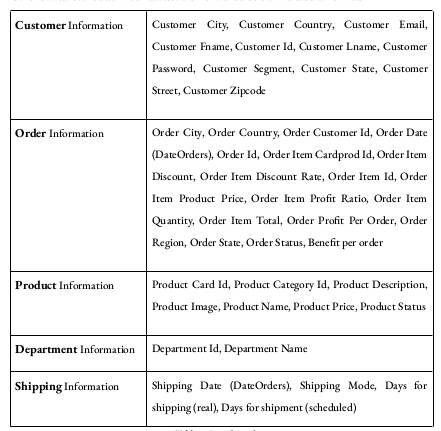
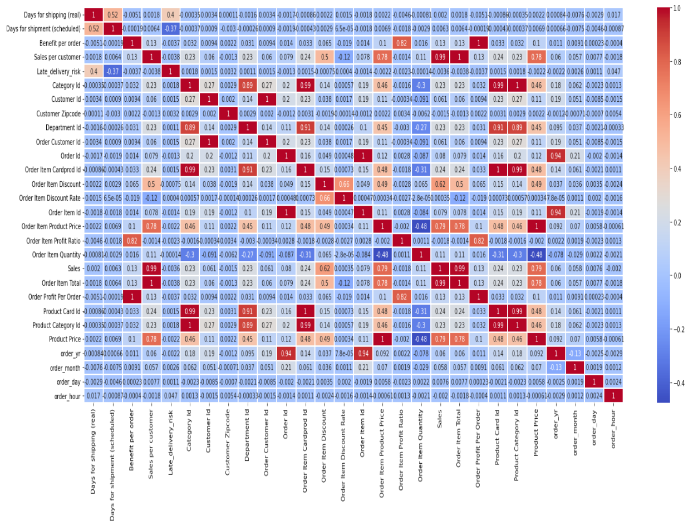
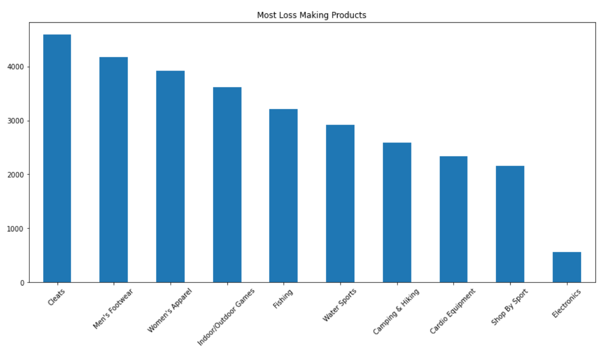
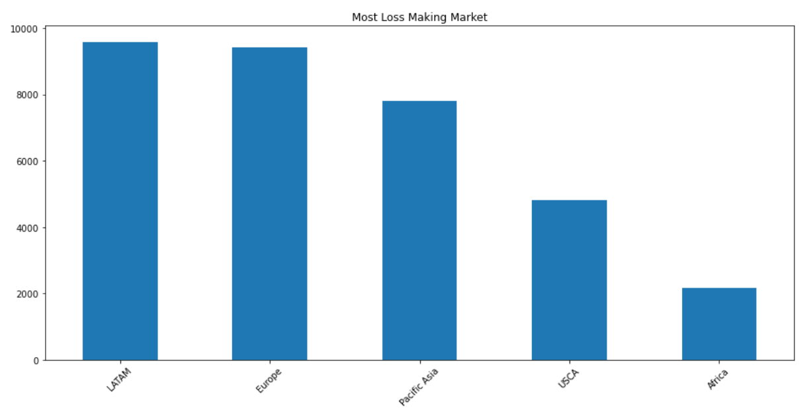
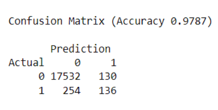

# Artificial Neural Networks for Fraud Detection in Supply Chain Analytics: A Study on MLPClassifier and Keras

In this study, we aimed to detect fraudulent activities in the supply chain through the use of neural networks. The study focused on building two machine learning models using the MLPClassifier algorithm from the scikit-learn library and a custom neural network using the Keras library in Python. Both models were trained and tested on the DataCo Supply Chain dataset. The results showed that the custom neural network achieved an accuracy of 97.67% in detecting fraudulent transactions, demonstrating its potential to minimize financial losses for organizations.

## Tools Used:
- Python
- SciKit Learn
- Seaborn
- Pandas
- TensorFlow
- Keras
- Matplotlib
- Plotly

## Introduction 
In recent years, the use of neural networks in supply chain analytics has gained considerable traction as organisations look for ways to improve their operations and make more informed decisions. One area where neural networks can have a significant impact is in the detection of fraud before shipments are processed. Fraudulent activities can cause significant financial losses, and early detection is essential for minimising any damage.
We present our study on the use of neural networks for detecting fraud in the supply chain. Two models were developed as part of this study: one using the MLPClassifier algorithm from the scikit-learn library, and another using a custom neural network built using the Keras library in Python. These models were developed using open-source libraries, including NumPy for numerical computation, Pandas for data manipulation, Seaborn for statistical data visualisation, matplotlib for plotting, and the machine learning frameworks SciKit Learn, Keras, and Tensorflow (backend). The scikit-learn library is a widely used machine learning library in Python, and the MLPClassifier algorithm from this library is a type of multi-layer perceptron classifier that has been shown to perform well on various classification tasks. The custom neural network, on the other hand, was designed to provide a deeper level of control over the architecture and training process, allowing for a more customised solution. The objective of our study is to identify potential fraudulent activities in the supply chain before shipments are processed, thus reducing the risk of financial loss for the organisation.Some of the most important attributes in our dataset are as follows with their description:

* **Type**: Kind of transaction made
* **Sales per customer**: Total sales made for each customer
* **Delivery Status**: State of the order delivery: Early shipment, delayed delivery, cancelled
shipment, or on-time shipment
* **Late_delivery_risk**: A categorical variable indicating if the delivery is late (1) or not (0)
* **Category Id**: Code for the product category
* **Category Name**: Description of the product category
* **Market**: Delivery destination for order: Africa, Europe, LATAM, Pacific Asia, USCA
* **Sales**: Sales value

Other critical attributes in our dataset are mentioned below in a tabular format:

## Data Cleaning and Handling Missing Data Values

In order to effectively analyze the supply chain data, it was obligatory to perform data cleaning
and handling on the dataframe (df). We start by identifying and removing any irrelevant
columns that would not contribute to the analysis. Columns such as 'Customer Email',
'Product Status', 'Customer Password', 'Customer Street', 'Customer Fname', 'Customer
Lname', 'Latitude', 'Longitude', 'Product Description', 'Product Image', 'Order Zipcode', and
'shipping date (DateOrders)' were deemed unnecessary and were therefore dropped from the
data set. The data cleaning process was done in-place, which means that the original data frame
was modified and the shape of the modified data frame was printed, revealing that there were
180519 rows and 42 columns.
Next, we used the df.isnull().sum() function to check for missing values in the DataFrame and
found that only the 'Customer Zipcode' column had three missing values. These missing values
were filled with zeros to ensure that no information was lost during the analysis process.
Additionally, a new column named ‘Cust_Full_Name’ was created by joining ‘Customer
Fname’ and ‘Customer Lname’.
Finally, we created new columns from the 'order date (DateOrders)' column to allow for a more
in-depth analysis of the data. By using the 'pd.DatetimeIndex' function, the date string was
converted into year, month, day, and hour and stored in separate columns, namely 'order_yr',
'order_month', 'order_day', and 'order_hour'. This provided valuable information about the
timing of the orders and allowed us to better understand the trends and patterns in the supply
chain data.
By performing these data cleaning and handling steps, we ensured that the data was ready for
analysis and modelling and also that we had the information we needed to make informed
decisions about the supply chain processes

## Exploratory Data Analysis

In order to gain further insights into the data and identify trends, we conducted an exploratory
data analysis (EDA) of our DataCo Global Supply Chain data. The first step in our EDA was to
create a heatmap that revealed some products have a negative benefit per order, which indicates
that these orders are causing losses for the company. To further investigate this issue, we created
two bar graphs using the Python data visualisation libraries ‘plotly’ and ‘seaborn’.
We filtered the data to only include rows where the 'Benefit per order' was negative, and saved
this filtered data in a separate DataFrame named "loss". The first bar graph shows the top-10
most loss-making products based on their category name, while the second bar graph depicts
the top-5 most loss-making markets. These graphs helped us understand how different features,
like product categories and markets, impacted the outcome variable 'Benefit per order'.

#### Correlation Heatmap in CoolWarm:

#### Top 10 Most Loss Making Products:

#### Top-5 Most Loss Making Markets:

### Data Modelling - Neural Networks

As part of this study, two machine learning models were developed to predict the outcome of
sales orders. One model was developed using the MLPClassifier algorithm from the scikit-learn
library, while the other was developed using a custom neural network built with the Keras
library in Python.

### Data Pre-Processing

Before building the models, all object-type variables were encoded, and the data was prepared
for modelling. To do this, 10% of the dataset was selected for validation, while the remaining
90% was split into training data (70%) and test data (30%). The StandardScaler() function from
scikit-learn was used to fit-scale the training data, and it was then ready for modeling.
This indicates that the machine learning model has high accuracy in both training and test
datasets. The model's performance on the training set is 97.77% accurate, which suggests that it
has learned the patterns in the data well. The performance on the test set (97.68%) is slightly
lower but still high, indicating that the model generalises well to unseen data. However, it's
important to consider if the model may be overfitting the training data, in which case the
accuracy on the test set may be lower than expected.

### MLPClassifier

MLP neural network transforms inputs into outputs using a layered structure. It's composed of
interconnected nodes, where all layers except the input layer contain non-linear neurons with
activation functions. The hidden layers, which can be one or many, introduce non-linearity and
enable the network to learn complex input-output relationships.

### Keras - Custom

The second model was a custom neural network, which had 1024 nodes.
Keras is a Python-based deep learning API. The custom neural network was trained using the fit method,
with an initial number of 10 epochs. The results showed that the train and test accuracy was
high, at approximately 97%, while the loss was approximately 8.88%. However, increasing the
number of epochs to 15 significantly reduced the loss and prevented overfitting of the data. The
final F1 score calculated was 96.58%.

### Model Validation and Evaluation

It is imperative to assess the performance of our models to ensure their effectiveness and
reliability. One commonly used method for this purpose is the confusion matrix. A confusion
matrix is a tool that summarises the true positive, false positive, true negative, and false negative
predictions made by a classifier. This information is used to calculate the accuracy of the model,
which is an important metric in determining the performance of the algorithm. Our confusion
matrix model has a remarkable accuracy of 97.89%.
The difference in accuracy between the two models is small, with the MLPClassifier model
having a slightly higher accuracy (97.87%) compared to the custom Neural Network (97.84%).
However, overfitting can still occur in both models and it's important to consider other
evaluation metrics such as precision, recall, and F1-score, as well as techniques to prevent
overfitting such as early stopping, regularisation, and cross-validation.

#### Confusion Matrix:

## Conclusion

The focus of our study was to investigate the feasibility of using neural networks for detecting
fraud in DataCo Global’s supply chain. Two models were developed as part of this study: the
MLPClassifier from the scikit-learn library and a custom neural network built with the Keras
library in Python. The results showed that both models demonstrated high accuracy and a
strong F1 score. In conclusion, the results of this study highlights the potential for neural
networks to play a key role in the detection of fraud in the supply chain, and serves as a stepping
stone for further research in these areas.